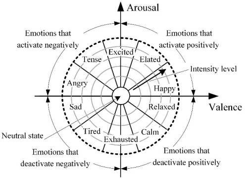
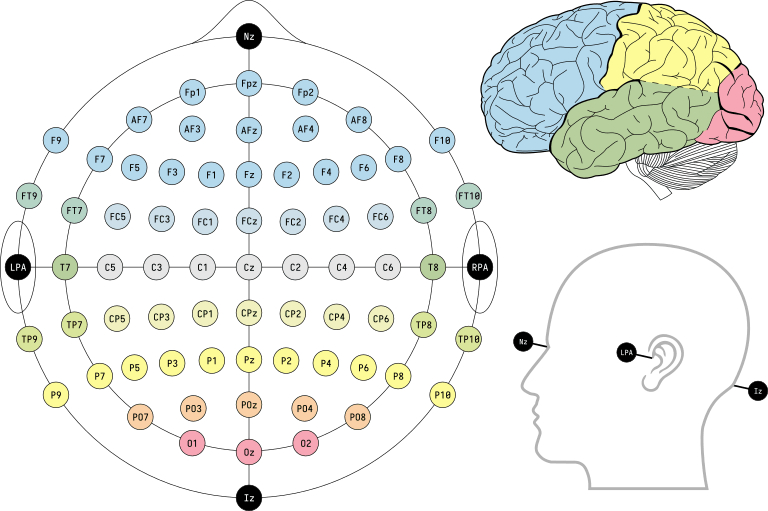

# Research On Music Generation Using Brain Waves:

> ## there are many levels to this data.

> ## a. we first need to understand what kind of different neuro waves are there.

### → Neuro waves are basically classified based on there frequencies ranges: -Delta(<4Hz) - Slowest, usually seen during deep sleep, -Theta(4-8Hz) - Slow, usually seen during drowsiness, -Alpha(8-13Hz) - Relaxed but awake, -Beta(13-30Hz) - Alert, focused thinking and problem solving, -Gamma(30-100Hz) - fastest,usually seen during high mental activity.

 

> ## b. what can be measured by the present sensors.

### → EEG-Electrodes can measure electrical activity (changes in voltage levels) of different positions of brain.  EMG-Electrodes: Motor neurons transmit electrical signals that cause muscles to contract. An EMG uses tiny devices called electrodes to translate these signals into graphs, sounds or numerical values. More on :https://www.ncbi.nlm.nih.gov/pmc/articles/PMC7037130/#B52-sensors-20-00592

> ## c. what waves are related to what kind of processes & emotions.

### → Gamma waves (30-100 Hz): High cognitive processing, perception, and consciousness. Beta waves (12-30 Hz): Alertness, concentration, and active thinking. Alpha waves (8-12 Hz): Relaxation, calmness, and a sense of well-being. Theta waves (4-8 Hz): Drowsiness, meditation, and deep relaxation. Delta waves (0.5-4 Hz): Deep sleep and unconsciousness.

- > ## Emotion Classification: Arousal-Valence methord  
  >
  > 
  >   
- > ## Positions of electrodes: 
  >
  > 
  >
  >   
- > ## What is EEG and how it works: 
  >
  > ### https://www.youtube.com/watch?v=YTH-CXphdXw

## Pricing section:

1. ### Headsets:

- > ### Emotive Insight:
  >
  > Description: 5 - channel EEG headset 
  > Link: https://www.emotiv.com/product/emotiv-insight-5-channel-mobile-brainwear/# 
  > Price: $499
- > ### Emotive Insight:
  >
  > Description: 5 - channel EEG headset 
  > Link: https://www.emotiv.com/product/emotiv-insight-5-channel-mobile-brainwear/# 
  > Price: $499
